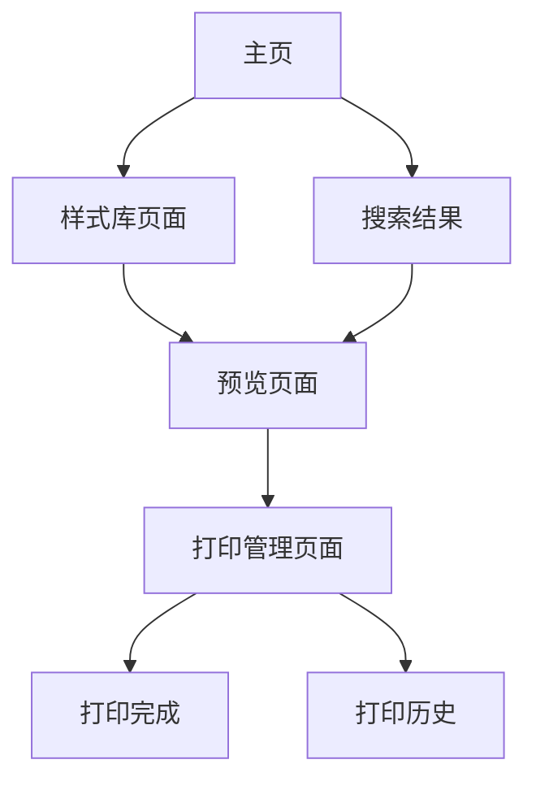

# PaperCraft 纸艺应用产品需求文档

## 1. 产品概述
PaperCraft是一款数字化纸艺应用，让用户无需购买各种样式纸张，通过选择预设的纸张模板、实时预览效果并直接打印所需的装饰纸张。
- 解决用户需要各种样式纸张但不想大量采购的痛点，提供便捷的数字化纸艺解决方案。
- 目标市场：手工爱好者、教育机构、办公场所等需要装饰纸张的用户群体。

## 2. 核心功能

### 2.1 用户角色
本产品面向普通用户，无需复杂的角色区分。

### 2.2 功能模块
我们的纸艺应用包含以下主要页面：
1. **主页**：纸张分类导航、热门样式展示、搜索功能
2. **样式库页面**：纸张样式浏览、分类筛选、样式详情
3. **预览页面**：样式预览、尺寸调整、打印设置
4. **打印管理页面**：打印机连接、打印队列、打印历史

### 2.3 页面详情

| 页面名称 | 模块名称 | 功能描述 |
|----------|----------|----------|
| 主页 | 导航分类 | 显示纸张样式分类（花纹、几何、节日主题等），快速导航到不同类别 |
| 主页 | 热门推荐 | 展示热门和最新的纸张样式，支持快速预览 |
| 主页 | 搜索功能 | 支持关键词搜索特定样式的纸张模板 |
| 样式库页面 | 样式展示 | 网格布局展示所有可用的纸张样式，支持缩略图预览 |
| 样式库页面 | 分类筛选 | 按主题、颜色、复杂度等维度筛选纸张样式 |
| 样式库页面 | 样式详情 | 显示样式的详细信息、适用场景和预览图 |
| 预览页面 | 实时预览 | 高清显示选中的纸张样式，支持缩放查看细节 |
| 预览页面 | 尺寸设置 | 选择打印纸张尺寸（A4、A3、自定义等） |
| 预览页面 | 打印参数 | 设置打印质量、颜色模式、份数等参数 |
| 打印管理页面 | 打印机连接 | 检测和连接可用的打印机设备 |
| 打印管理页面 | 打印队列 | 管理待打印和正在打印的任务 |
| 打印管理页面 | 打印历史 | 查看已完成的打印记录和重新打印功能 |

## 3. 核心流程

用户主要操作流程：
1. 用户进入主页，浏览纸张分类或使用搜索功能
2. 选择感兴趣的分类进入样式库页面
3. 在样式库中浏览和筛选纸张样式
4. 点击心仪的样式进入预览页面
5. 在预览页面调整尺寸和打印参数
6. 确认设置后发送到打印队列
7. 在打印管理页面监控打印进度
8. 完成打印并可查看打印历史

## 4. 用户界面设计

### 4.1 设计风格
- 主色调：温暖的米白色(#F8F6F0)和深绿色(#2D5A27)
- 辅助色：淡粉色(#F4C2C2)和金黄色(#FFD700)
- 按钮样式：圆角矩形按钮，带有轻微阴影效果
- 字体：主标题使用18-24px，正文使用14-16px，采用清晰易读的无衬线字体
- 布局风格：卡片式布局，顶部导航栏设计
- 图标风格：简洁的线条图标，配合纸艺主题的装饰元素

### 4.2 页面设计概览

| 页面名称 | 模块名称 | UI元素 |
|----------|----------|--------|
| 主页 | 导航分类 | 水平滚动的分类卡片，每个卡片包含图标和分类名称，使用主色调背景 |
| 主页 | 热门推荐 | 3x2网格布局展示热门样式，卡片式设计带有样式缩略图和名称 |
| 主页 | 搜索功能 | 顶部搜索栏，圆角设计，带有搜索图标和占位符文本 |
| 样式库页面 | 样式展示 | 响应式网格布局，每个样式卡片显示缩略图、名称和快速预览按钮 |
| 样式库页面 | 分类筛选 | 左侧筛选面板，包含复选框和滑块控件，可折叠设计 |
| 预览页面 | 实时预览 | 中央大尺寸预览区域，白色背景突出纸张样式，支持鼠标滚轮缩放 |
| 预览页面 | 尺寸设置 | 右侧设置面板，下拉选择框和数值输入框，实时更新预览 |
| 打印管理页面 | 打印机连接 | 打印机状态指示器，连接按钮使用绿色主题色 |
| 打印管理页面 | 打印队列 | 列表式布局显示打印任务，包含进度条和操作按钮 |

### 4.3 响应式设计
产品采用桌面优先的设计策略，同时适配平板设备。考虑到打印功能的特殊性，主要针对桌面端使用场景进行优化，确保打印预览和设置的精确性。