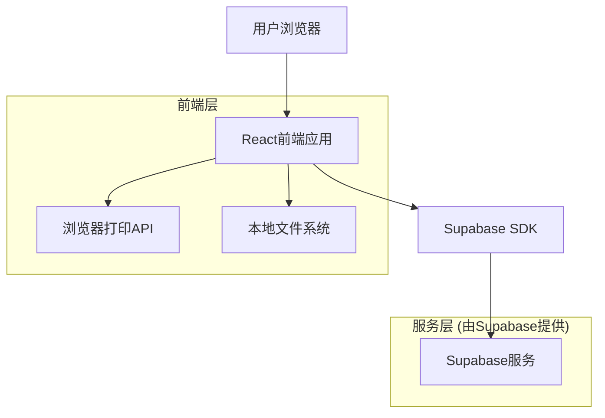
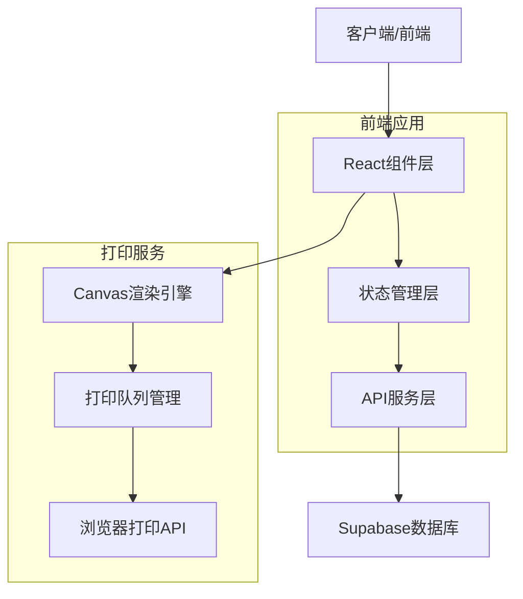

# PaperCraft 纸艺应用技术架构文档

## 1. 架构设计



## 2. 技术描述

* 前端: React\@18 + TypeScript + Tailwind CSS + Vite

* 后端: Supabase (提供数据库、存储和认证服务)

* 打印: 浏览器原生打印API + Canvas/SVG渲染

* 状态管理: React Context + useState/useReducer

## 3. 路由定义

| 路由                 | 用途                    |
| ------------------ | --------------------- |
| /                  | 主页，显示纸张分类和热门样式推荐      |
| /gallery           | 样式库页面，浏览和筛选所有纸张样式     |
| /gallery/:category | 特定分类的样式展示页面           |
| /preview/:styleId  | 预览页面，显示选中样式的详细预览和打印设置 |
| /print-manager     | 打印管理页面，管理打印队列和历史记录    |
| /search            | 搜索结果页面，显示搜索匹配的纸张样式    |

## 4. API定义

### 4.1 核心API

纸张样式相关

```
GET /api/styles
```

请求参数:

| 参数名称     | 参数类型   | 是否必需  | 描述     |
| -------- | ------ | ----- | ------ |
| category | string | false | 样式分类筛选 |
| search   | string | false | 搜索关键词  |
| limit    | number | false | 返回数量限制 |
| offset   | number | false | 分页偏移量  |

响应:

| 参数名称    | 参数类型         | 描述      |
| ------- | ------------ | ------- |
| styles  | Array<Style> | 纸张样式列表  |
| total   | number       | 总数量     |
| hasMore | boolean      | 是否有更多数据 |

示例:

```json
{
  "styles": [
    {
      "id": "style_001",
      "name": "樱花飘落",
      "category": "花纹",
      "thumbnailUrl": "/images/cherry_blossom_thumb.jpg",
      "fullImageUrl": "/images/cherry_blossom_full.svg",
      "tags": ["春天", "粉色", "浪漫"],
      "createdAt": "2024-01-15T10:30:00Z"
    }
  ],
  "total": 156,
  "hasMore": true
}
```

打印历史相关

```
POST /api/print-history
```

请求:

| 参数名称          | 参数类型   | 是否必需 | 描述     |
| ------------- | ------ | ---- | ------ |
| styleId       | string | true | 纸张样式ID |
| paperSize     | string | true | 纸张尺寸   |
| printSettings | object | true | 打印参数设置 |

响应:

| 参数名称    | 参数类型    | 描述     |
| ------- | ------- | ------ |
| success | boolean | 操作是否成功 |
| printId | string  | 打印记录ID |

## 5. 服务器架构图



## 6. 数据模型

### 6.1 数据模型定义

```mermaid
erDiagram
  STYLE ||--o{ PRINT_HISTORY : generates
  CATEGORY ||--o{ STYLE : contains
  USER ||--o{ PRINT_HISTORY : creates

  STYLE {
    string id PK
    string name
    string category_id FK
    string thumbnail_url
    string full_image_url
    json tags
    timestamp created_at
    timestamp updated_at
  }
  
  CATEGORY {
    string id PK
    string name
    string description
    string icon_url
    integer sort_order
  }
  
  PRINT_HISTORY {
    string id PK
    string user_id FK
    string style_id FK
    string paper_size
    json print_settings
    string status
    timestamp created_at
  }
  
  USER {
    string id PK
    string email
    string name
    timestamp created_at
  }
```

### 6.2 数据定义语言

纸张样式表 (styles)

```sql
-- 创建样式表
CREate TABLE styles (
    id UUID PRIMARY KEY DEFAULT gen_random_uuid(),
    name VARCHAR(100) NOT NULL,
    category_id UUID REFERENCES categories(id),
    thumbnail_url TEXT NOT NULL,
    full_image_url TEXT NOT NULL,
    tags JSONB DEFAULT '[]',
    created_at TIMESTAMP WITH TIME ZONE DEFAULT NOW(),
    updated_at TIMESTAMP WITH TIME ZONE DEFAULT NOW()
);

-- 创建索引
CREATE INDEX idx_styles_category ON styles(category_id);
CREATE INDEX idx_styles_created_at ON styles(created_at DESC);
CREATE INDEX idx_styles_tags ON styles USING GIN(tags);

-- 权限设置
GRANT SELECT ON styles TO anon;
GRANT ALL PRIVILEGES ON styles TO authenticated;
```

分类表 (categories)

```sql
-- 创建分类表
CREATE TABLE categories (
    id UUID PRIMARY KEY DEFAULT gen_random_uuid(),
    name VARCHAR(50) NOT NULL UNIQUE,
    description TEXT,
    icon_url TEXT,
    sort_order INTEGER DEFAULT 0,
    created_at TIMESTAMP WITH TIME ZONE DEFAULT NOW()
);

-- 权限设置
GRANT SELECT ON categories TO anon;
GRANT ALL PRIVILEGES ON categories TO authenticated;

-- 初始数据
INSERT INTO categories (name, description, icon_url, sort_order) VALUES
('花纹', '各种花卉和植物图案的装饰纸张', '/icons/floral.svg', 1),
('几何', '几何图形和抽象图案的现代纸张', '/icons/geometric.svg', 2),
('节日主题', '适合各种节日庆典的主题纸张', '/icons/holiday.svg', 3),
('纯色渐变', '简约的纯色和渐变效果纸张', '/icons/gradient.svg', 4),
('复古风格', '怀旧和复古风格的装饰纸张', '/icons/vintage.svg', 5);
```

打印历史表 (print\_history)

```sql
-- 创建打印历史表
CREATE TABLE print_history (
    id UUID PRIMARY KEY DEFAULT gen_random_uuid(),
    user_id UUID REFERENCES auth.users(id),
    style_id UUID REFERENCES styles(id),
    paper_size VARCHAR(20) NOT NULL,
    print_settings JSONB DEFAULT '{}',
    status VARCHAR(20) DEFAULT 'completed' CHECK (status IN ('pending', 'printing', 'completed', 'failed')),
    created_at TIMESTAMP WITH TIME ZONE DEFAULT NOW()
);

-- 创建索引
CREATE INDEX idx_print_history_user_id ON print_history(user_id);
CREATE INDEX idx_print_history_created_at ON print_history(created_at DESC);
CREATE INDEX idx_print_history_style_id ON print_history(style_id);

-- 权限设置
GRANT SELECT, INSERT ON print_history TO authenticated;
```

